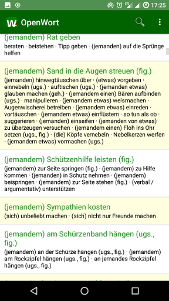
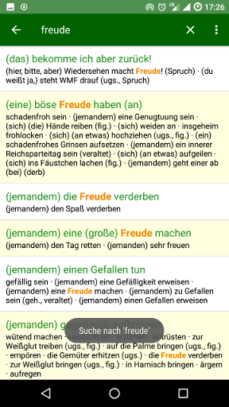
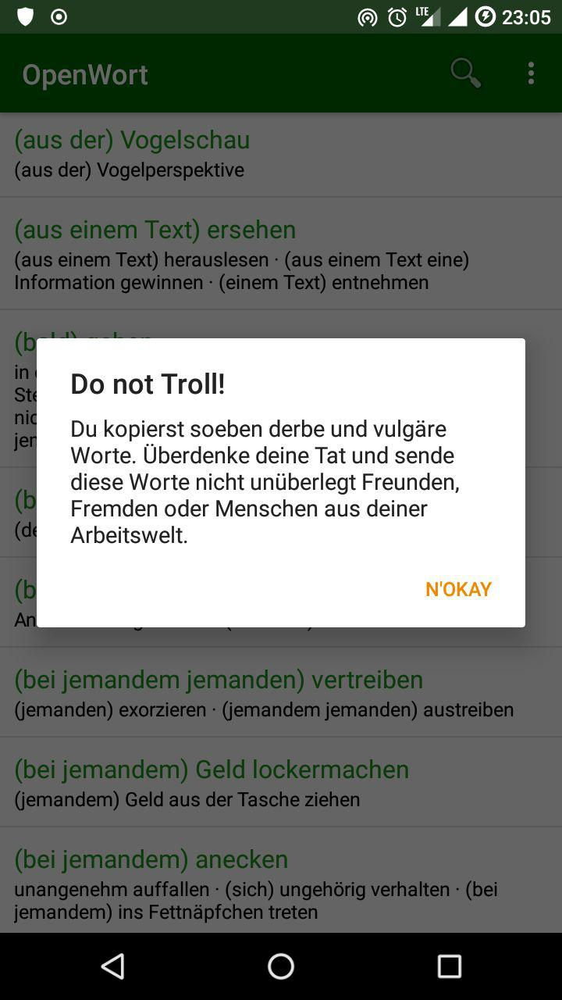
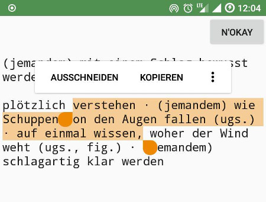

# OpenWort App (Android)

OpenWort is a VERY simple german Thesaurus app.

Features:

 -  works offline
 -  very simple
 -  german
 -  search and highlight results
 -  click to copy entry to clipboard OR
 -  ... use a Copy-Paste editor window

## Get the App

You can get a signed APK from here (Android 4.1+): [APK](https://raw.githubusercontent.com/no-go/Wortschatz/master/app/release/app-release.apk)

## Privacy Policy

### Personal information.

Personal information is data that can be used to uniquely identify or contact a single person. I DO NOT collect, transmit, store or use any personal information while you use this app.

### Non-Personal information.

I DO NOT collect non-personal information like user's behavior:

 -  to solve App problems
 -  to show personalized ads

The google play store collect non-personal information such as the data of install (country and equipment).

### Privacy Questions.

If you have any questions or concerns about my Privacy Policy or data processing, please contact me.

## Licenses

### License - My Android Code

This is free and unencumbered software released into the public domain.

Anyone is free to copy, modify, publish, use, compile, sell, or distribute this software, either in source code form or as a compiled binary, for any purpose, commercial or non-commercial, and by any means.

In jurisdictions that recognize copyright laws, the author or authors of this software dedicate any and all copyright interest in the software to the public domain. We make this dedication for the benefit of the public at large and to the detriment of our heirs and successors. We intend this dedication to be an overt act of relinquishment in perpetuity of all present and future rights to this software under copyright law.

THE SOFTWARE IS PROVIDED "AS IS", WITHOUT WARRANTY OF ANY KIND, EXPRESS OR IMPLIED, INCLUDING BUT NOT LIMITED TO THE WARRANTIES OF MERCHANTABILITY, FITNESS FOR A PARTICULAR PURPOSE AND NONINFRINGEMENT. IN NO EVENT SHALL THE AUTHORS BE LIABLE FOR ANY CLAIM, DAMAGES OR OTHER LIABILITY, WHETHER IN AN ACTION OF CONTRACT, TORT OR OTHERWISE, ARISING FROM, OUT OF OR IN CONNECTION WITH THE SOFTWARE OR THE USE OR OTHER DEALINGS IN THE SOFTWARE.

For more information, please refer to http://unlicense.org

### License - OpenThesaurus File

My Code uses a text file from [openthesaurus.de](https://www.openthesaurus.de)
with this license:

    OpenThesaurus - German Thesaurus in text format
    Automatically generated 2018-02-01 23:01
    https://www.openthesaurus.de
    Copyright (C) 2003-2017 Daniel Naber (naber at danielnaber de)
    
    This library is free software; you can redistribute it and/or
    modify it under the terms of the GNU Lesser General Public
    License as published by the Free Software Foundation; either
    version 2.1 of the License, or (at your option) any later version.
    
    This library is distributed in the hope that it will be useful,
    but WITHOUT ANY WARRANTY; without even the implied warranty of
    MERCHANTABILITY or FITNESS FOR A PARTICULAR PURPOSE.  See the GNU
    Lesser General Public License for more details.
    
    You should have received a copy of the GNU Lesser General Public
    License along with this library; if not, write to the Free Software
    Foundation, Inc., 51 Franklin St, Fifth Floor, Boston, MA  02110-1301 USA

## Screenshots

## Hints to add a App to f-droid.org

you need a gitlab.com account (or use a github.com account).

 -  you need android sdk (you need some export or path hints?)
 -  export ANDROID_HOME=/home/LOCALUSER/Android/Sdk/
 -  do a git clone fdroidserver and touch config (?)
 -  export PATH="$PATH:$PWD/fdroidserver"
 -  FORK via webgui gitlab fdroid fdroiddata
 -  git clone git@gitlab.com:YOURUSERNAME/fdroiddata.git
 -  cd fdroiddata
 -  fdroid init
 -  fdroid readmeta
 -  fdroid import --url https://github.com/no-go/Wortschatz.git --subdir app

modify metadata/de.digisocken.openwort.txt file:

    Categories:Reading
    License:Unlicense
    Author Name:deadlockz
    Web Site:https://github.com/no-go/Wortschatz/blob/HEAD/README.md
    Source Code:https://github.com/no-go/Wortschatz
    Issue Tracker:
    
    Auto Name:OpenWort
    Summary:Einfacher offline Thesaurus (Nachschlagewerk) der deutschen Sprache
    Description:
    OpenWort ist ein kleiner, einfach bedienbarer Thesaurus der deutschen Sprache
    mit vielen Redewendungen und Synonymen. Als Datenquelle dient eine Text-Datei
    von [http://www.openthesaurus.de/ OpenThesaurus] (LGPL Lizenz), die in
    die App fest eingebaut ist. Eine Internetverbindung ist daher zur
    Benutzung nicht notwendig.
    
    '''Funktionen'''
    
    * arbeitet offline (maximaler Datenschutz)
    * kein Dateizugriff (maximaler Datenschutz)
    * der Quellcode der App ist auch für Anfänger verständlich
    * In Suchergebnissen werden Funde hervorgehoben
    * ein Tippen auf einen Eintrag kopiert ihn komplett in die Zwischenablage
    
    Du kannst mit OpenWort die deutsche Sprache lernen oder knifflige Worte
    nachschlagen, die du sonst immer falsch geschrieben hast.
    .
    
    Repo Type:git
    Repo:https://github.com/no-go/Wortschatz
    
    Build:1.5,15
        commit=ebb88a1
        subdir=app
        gradle=yes
        target=android-26
    
    Auto Update Mode:Version v%v
    Update Check Mode:Tags
    Current Version:1.5
    Current Version Code:15

for the app code:

use git tag v1.5 -m "huibui" to notify changes to fdroid, but there
is app/build.gradle file with relevant version codes!

 -  fdroid readmeta
 -  fdroid rewritemeta de.digisocken.openwort
 -  fdroid checkupdates de.digisocken.openwort
 -  fdroid lint de.digisocken.openwort
     -  some hints? do the changes, readmeta, rewitemeta(?), and again:
 -  fdroid lint de.digisocken.openwort
 -  fdroid build -v -l de.digisocken.openwort
 -  git add *
 -  git status
     -  should be only one file!!
 -  git commit -m "OpenWort metadata added"
 -  git push
 -  MERGE via webgui request to fdroid/fdroiddata
 -  add hints about lint, fdroid ... the above stuff, and that all of it works well
 -  wait to be merged

### during merge request: you did something wrong?

 -  change it on your pc
 -  git add metadata/de.digisocken.openwort.txt
 -  git commit -m "bug is fixed"
 -  git push

### push not work? fare behind?

 -  it does not work, because your fork is fare behind? rebase your fork:
 -  git remote add upstream https://gitlab.com/fdroid/fdroiddata.git
 -  git fetch upstream
 -  maybe (git checkout master) ?
 -  compare my local repository with "upstream/master" and add my commits as local changes:
     -  git rebase upstream/master
 -  git pull (dangerous: this makes a merge with all your changes, if you push)
     -  comment it not as merge or remerge -> it is a rebase!
     -  git push
     -  alternative to pull, merge, push (?): git -f pull
 -  wait to be merged
 -  delete via webgui your fork

### metadata folder

 -  f-droid website uses content from de.digisocken.openwort.txt file
 -  f-droid website uses icon from your repository metadata folder
 -  f-droid updates data from your repository metadata folder only, if the App code/revison updates
 -  f-droid client: the text from your repository metadata folder must be html-like.

A good metadata text example: [Dandelion App](https://github.com/Diaspora-for-Android/dandelion/blob/6cac47763c00d3f9e11969e721ebb372ebe4084f/metadata/en-US/full_description.txt)

### fdroid and git todo

 -  history changing
 -  pick, edit, stash commits
 -  `git rebase -i HEAD~3` (last 3 commits from HEAD)
 -  `git add -p .`
 -  other stuff
