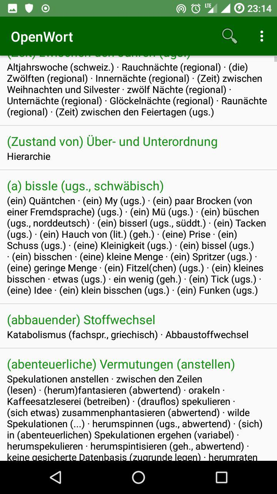
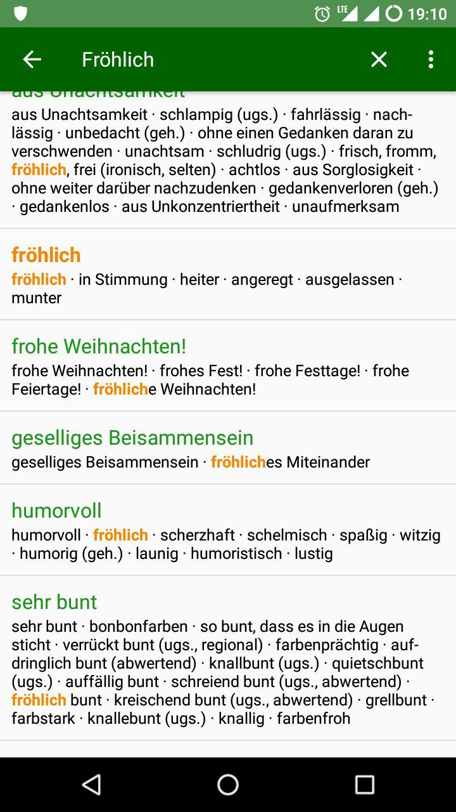

# OpenWort App (Android)

OpenWort is a VERY simple german Thesaurus app.

Features:

 -  works offline
 -  very simple
 -  german
 -  search and highlight results
 -  click to copy entry to clipboard

## Get the App

You can get a signed APK from here (Android 4.1+): [APK](https://raw.githubusercontent.com/no-go/Wortschatz/master/app/release/app-release.apk)

## Privacy Policy

### Personal information.

Personal information is data that can be used to uniquely identify or contact a single person. I DO NOT collect, transmit, store or use any personal information while you use this app.

### Non-Personal information.

I DO NOT collect non-personal information like user's behavior:

 -  to solve App problems
 -  to show personalized ads

The google play store collect non-personal information such as the data of install (country and equipment).

### Privacy Questions.

If you have any questions or concerns about my Privacy Policy or data processing, please contact me.

## Licenses

### License - My Android Code

This is free and unencumbered software released into the public domain.

Anyone is free to copy, modify, publish, use, compile, sell, or distribute this software, either in source code form or as a compiled binary, for any purpose, commercial or non-commercial, and by any means.

In jurisdictions that recognize copyright laws, the author or authors of this software dedicate any and all copyright interest in the software to the public domain. We make this dedication for the benefit of the public at large and to the detriment of our heirs and successors. We intend this dedication to be an overt act of relinquishment in perpetuity of all present and future rights to this software under copyright law.

THE SOFTWARE IS PROVIDED "AS IS", WITHOUT WARRANTY OF ANY KIND, EXPRESS OR IMPLIED, INCLUDING BUT NOT LIMITED TO THE WARRANTIES OF MERCHANTABILITY, FITNESS FOR A PARTICULAR PURPOSE AND NONINFRINGEMENT. IN NO EVENT SHALL THE AUTHORS BE LIABLE FOR ANY CLAIM, DAMAGES OR OTHER LIABILITY, WHETHER IN AN ACTION OF CONTRACT, TORT OR OTHERWISE, ARISING FROM, OUT OF OR IN CONNECTION WITH THE SOFTWARE OR THE USE OR OTHER DEALINGS IN THE SOFTWARE.

For more information, please refer to http://unlicense.org

### License - OpenThesaurus File

My Code uses a text file from [openthesaurus.de](https://www.openthesaurus.de)
with this license:

    OpenThesaurus - German Thesaurus in text format
    Automatically generated 2018-02-01 23:01
    https://www.openthesaurus.de
    Copyright (C) 2003-2017 Daniel Naber (naber at danielnaber de)
    
    This library is free software; you can redistribute it and/or
    modify it under the terms of the GNU Lesser General Public
    License as published by the Free Software Foundation; either
    version 2.1 of the License, or (at your option) any later version.
    
    This library is distributed in the hope that it will be useful,
    but WITHOUT ANY WARRANTY; without even the implied warranty of
    MERCHANTABILITY or FITNESS FOR A PARTICULAR PURPOSE.  See the GNU
    Lesser General Public License for more details.
    
    You should have received a copy of the GNU Lesser General Public
    License along with this library; if not, write to the Free Software
    Foundation, Inc., 51 Franklin St, Fifth Floor, Boston, MA  02110-1301 USA

## Screenshots

